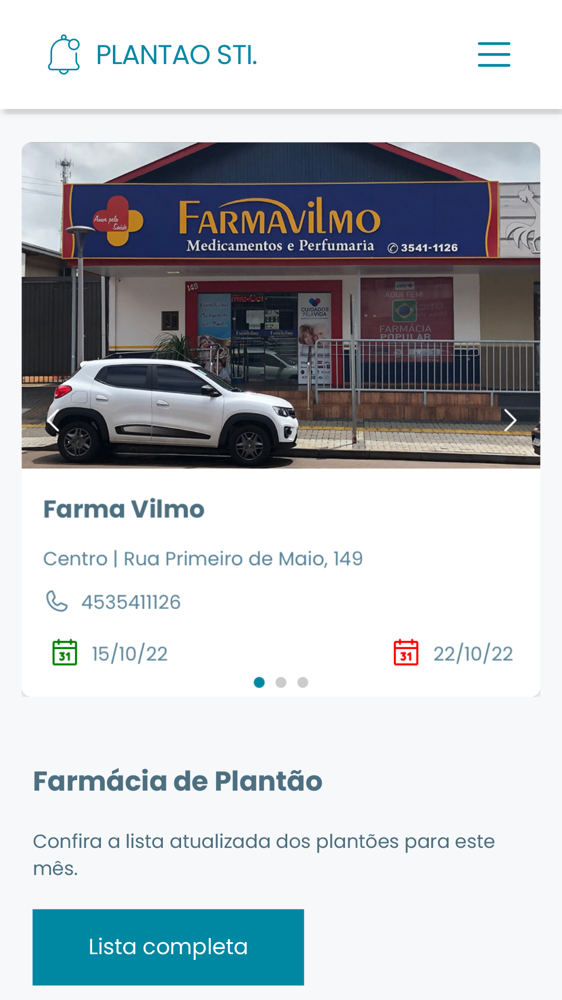
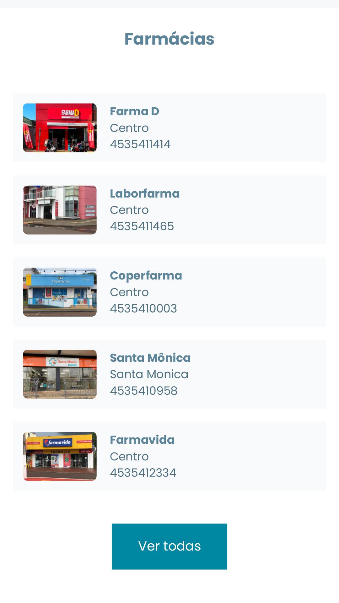
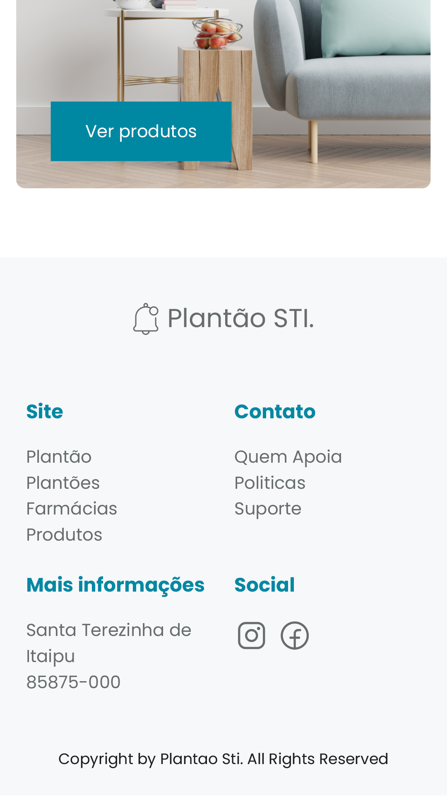

# Plantão STI

Ferramenta simples exclusiva para a minha cidade Santa Terezinha de Itaipu,
um acordo entre as farmácias resultou em uma lei municipal que determina inicio e fim do plantão para cada farmácia,
respeitando uma tabela pré-determinada, cada farmácia tem uma semana que permite suas atividades 24 horas,
com início as 12:00h no sábado e termino 11:59h do sábado seguinte, essa farmácia tem exclusividade para que seu atendimento
ao público seja feito sem interrupções durante 7 dias.

No formato de rodízio e respeitando o cronograma, todos os sábados uma farmácia finaliza o atendimento e outra inicia é nesse momento
em que o Plantão STI entra para fazer a diferença na rotina do cidadão Itaipuenses, nossa cidade hoje conta com treze farmácias
no total, a dúvida do cidadão surge aí, qual farmácia vai iniciar hoje ou qual está de plantão, o comum durante muito tempo, foi a busca manual
por essa informação obrigando o cidadão percorrer quase toda a cidade para descobrir muitas vezes que a farmácia ao lado da sua casa era a que estava
fazendo o atendimento normal. Plantão STI traz em suas funcionalidades exatamente essa informação oportuna, a ferramenta destaca não apenas farmácia plantonista mas também as próximas que sucederam,
contendo as informações básicas como endereço, contato, data do início e fim do plantão. Outra funcionalidade é a listagem com todas as farmácias seguidas também de suas informações.

Agora ao invés de percorrer toda a cidade em busca da farmácia aberta, sem sair de casa, você tem essas informações na palma das mãos ou na tela do seu computador.

## Funcionalidades

- Plantão em tempo real
- Lista com os próximos plantões
- Lista com os dados de todas as farmácias

## Screenshots

## Ferramentas

 - [X]  Reactjs
 - [X]  Vite
 - [X]  GraphCMS
 - [X]  Graphql
 - [X]  Apollo
 - [X]  Tailwind
 - [X]  Vercel

## Autor

- [@alopsantos](https://www.github.com/alopsantos)

